# TODO CINE (Angular)

This is the web client for the [Todo Cine API](https://github.com/abeltran10/todocine_backend), built with Angular 21. The application allows users to browse a vast catalog of movies, manage their favourites, and keep track of award-winning films.

## Requirements

Framework: Angular CLI 21.1.0

Environment: Node.js 24.13.0

Styling: Bootstrap 5 & Font Awesome 6 (Icons)

State Management: Service-based (BehaviorSubjects & Observables)

Authentication: JWT (JSON Web Tokens) with automated interceptors

## Architecture Pattern

The project follows a Modular Clean Architecture to ensure scalability and separation of concerns:

### Core Layer (/app/core)

The "brain" of the application. Contains singleton services and universal configurations.

- /enum: Strongly typed constants for Cines, and Regions.

- /guards: Security layer with AuthGuard (protected routes) and PublicGuard (login/register).

- /interceptors: Automatically injects the JWT Bearer Token into every HTTP request.

- /services: Centralized API communication logic.

- /models: TypeScript interfaces matching the Backend DTOs.

### Features Layer (/app/features)

Contains the functional modules of the app (e.g., Home, User Profile, Favoritos). Each feature is isolated to keep the project organized.

### Shared Layer (/app/shared)

Reusable resources used across multiple features.

- /common: Generic components Paginator.

- /layout: Global structure components like AppLayout, Navbar, Notification.


## Last release

- [v3.1.1](https://github.com/abeltran10/todocine_front_angular/releases/tag/v3.1.1)

## Commands

### Install dependencies

First, install dependencies:

```bash
npm install
```

### Development server

To start a local development server, run:

```bash
npm start
```

Once the server is running, open your browser and navigate to `http://localhost:4200/app`. The application will automatically reload whenever you modify any of the source files.


### Building

To build the project run:

```bash
npm run build
```
This will compile your project and store the build artifacts in the `dist/` directory. By default, the production build optimizes your application for performance and speed.


## UI
### Login
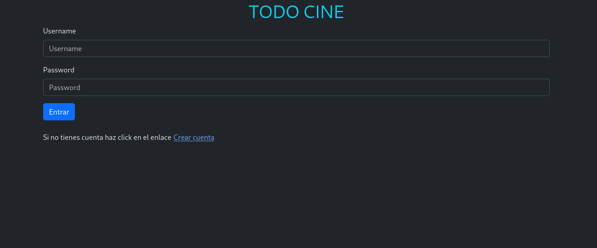

### Search
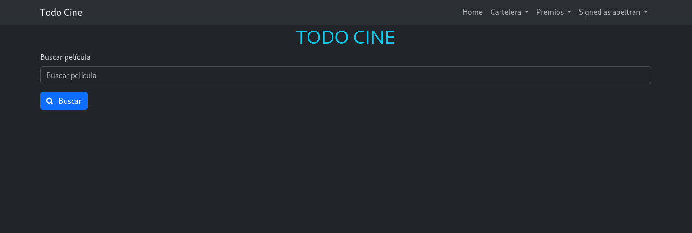


### Search results
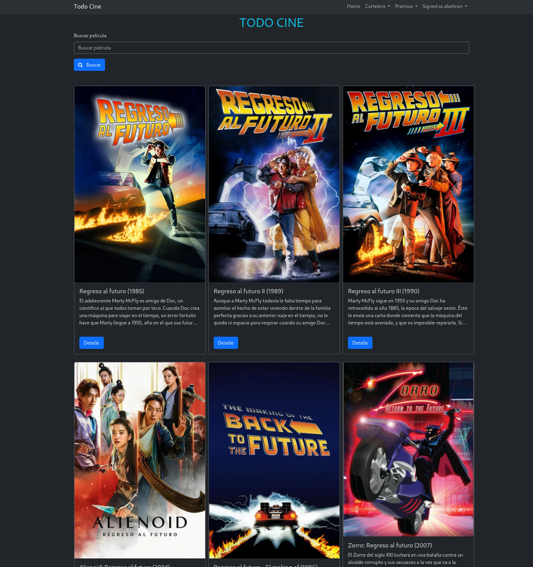


### Paginator
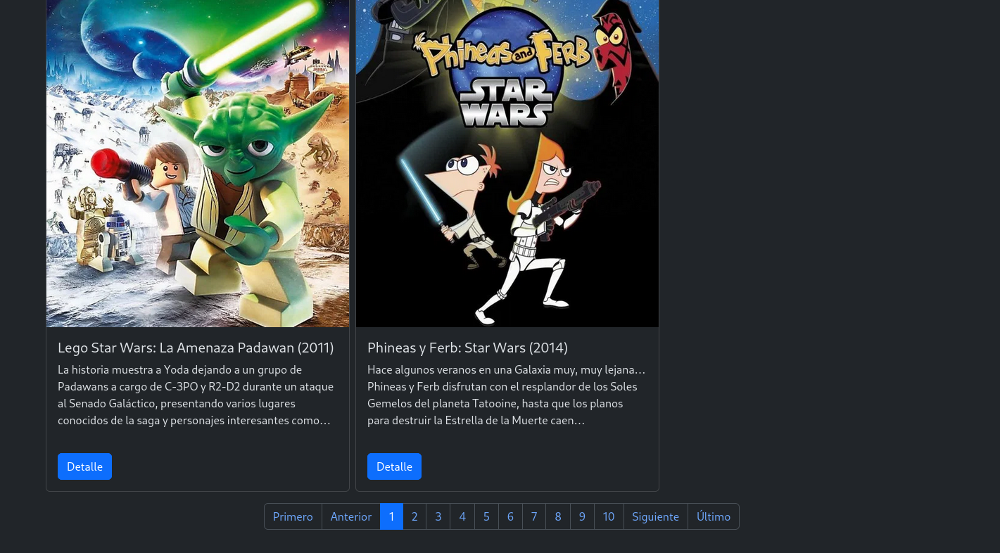


### Movies in theaters
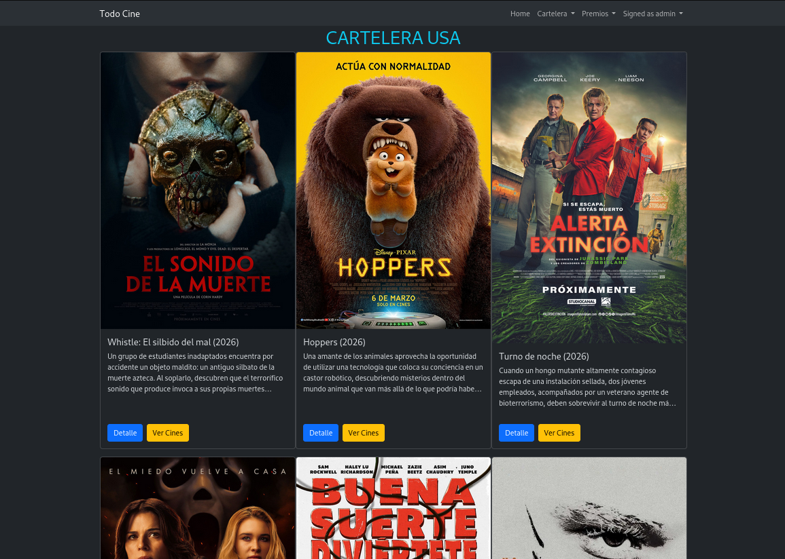


### Awards
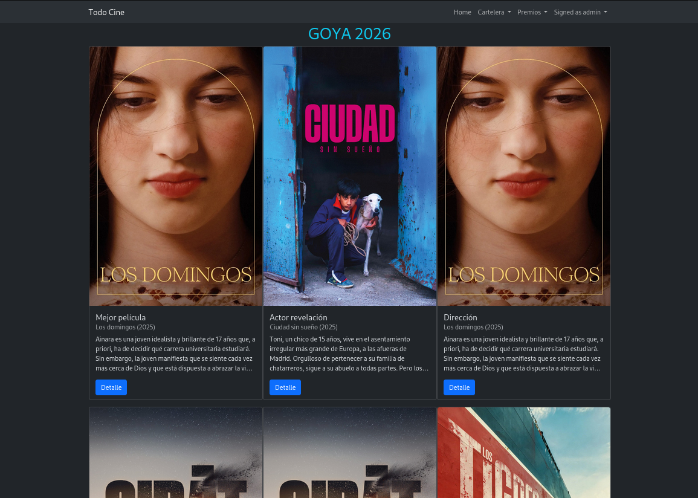


### Movie detail
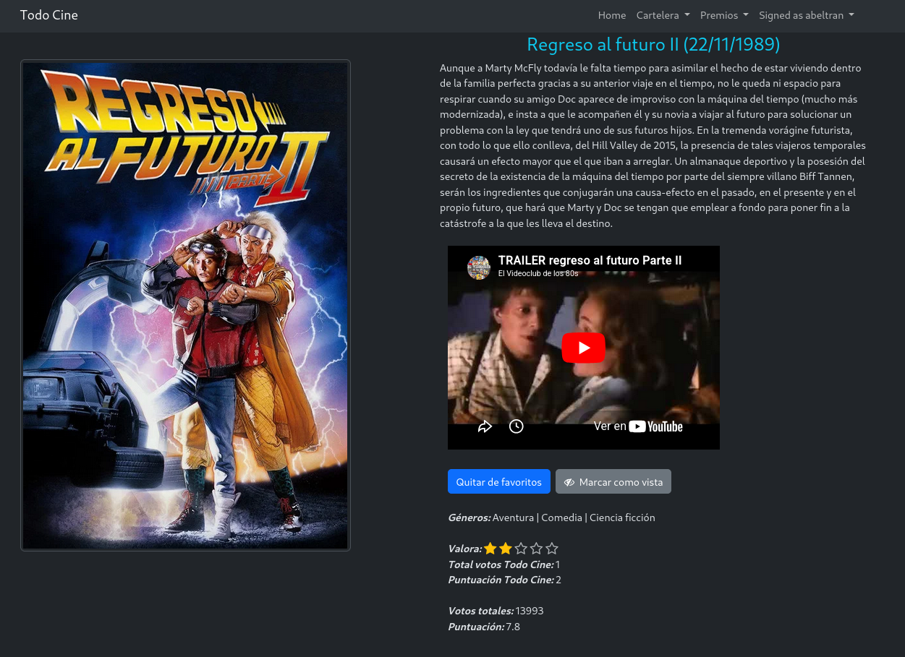


### Favourites
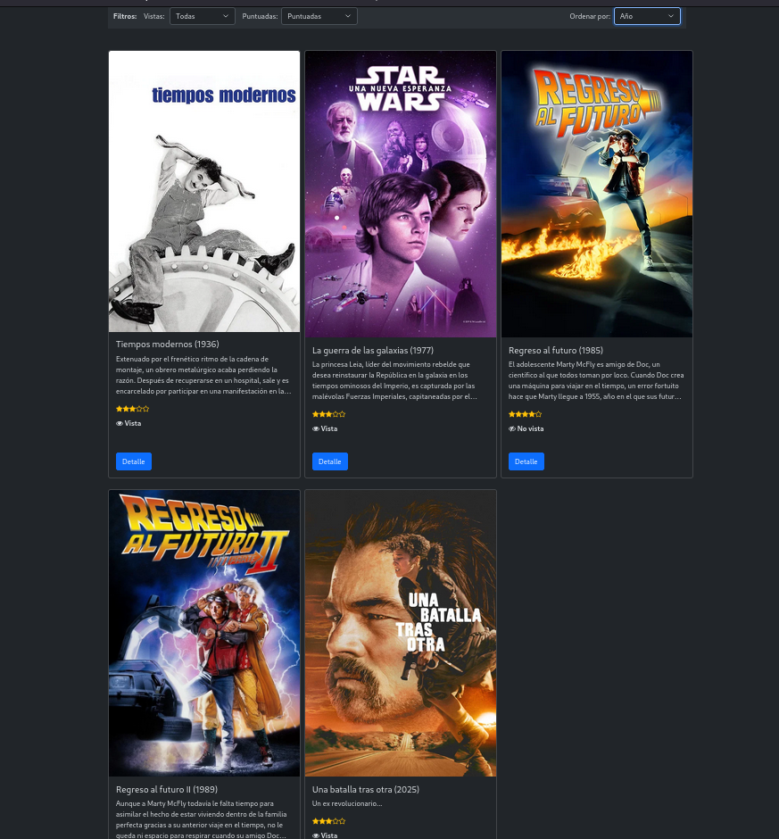


### Winner insert form (ADMIN)
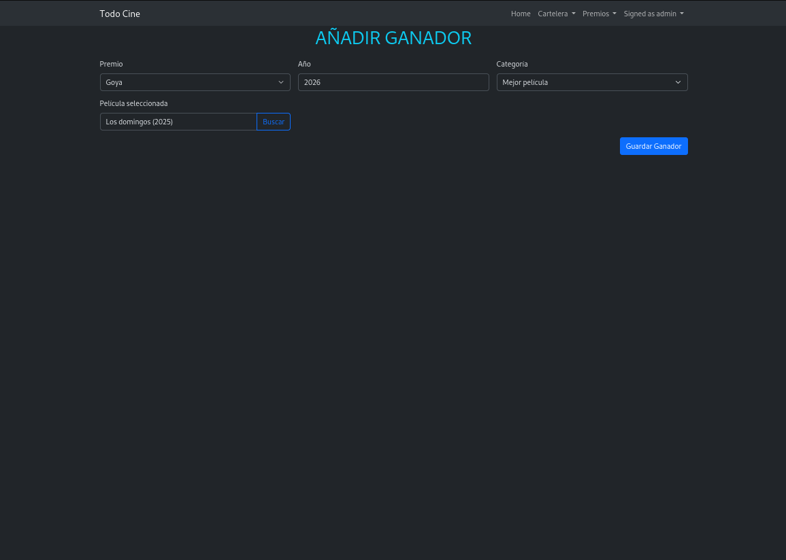

### Public Lists

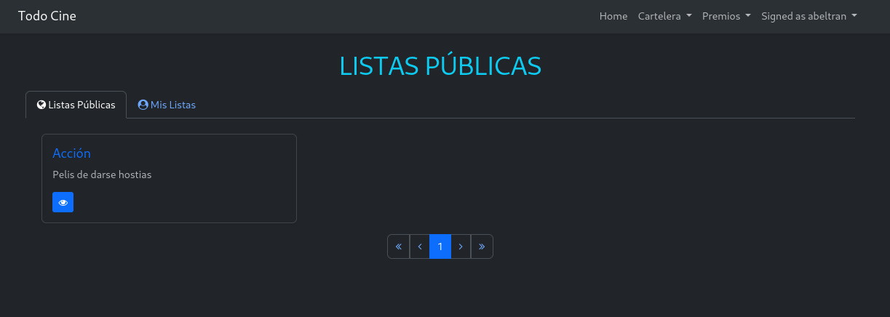


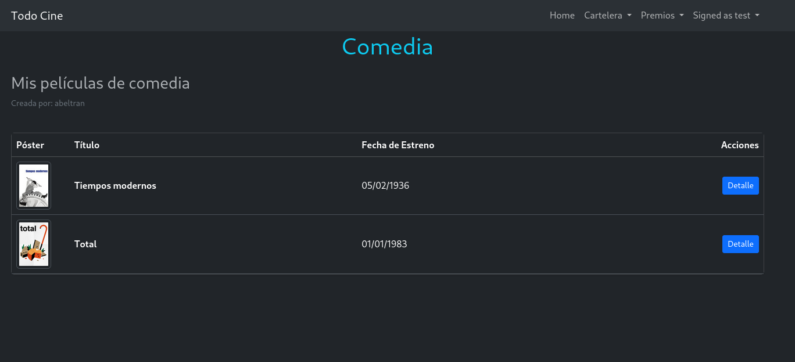


### Private Lists

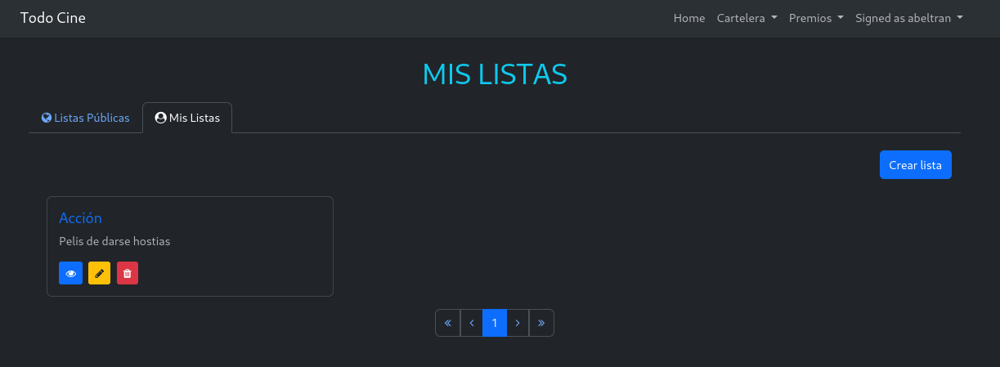

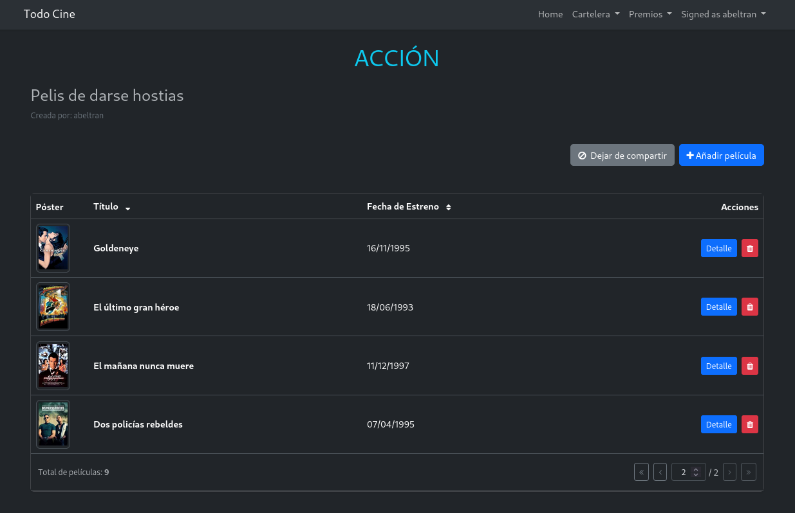


### Users' opinions about a list

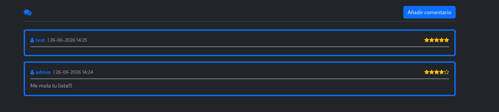


